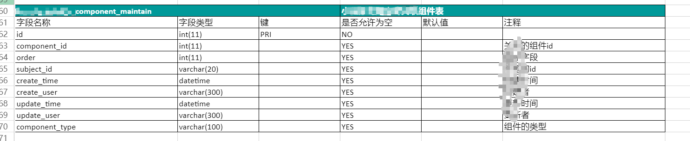

# kt
personal tools, base of cobra

## command list
- check: check file md5 an sha1 value
- db2excel: export mysql table struct to excel
   
- fs: golang http file server
- u2g: upload file to github